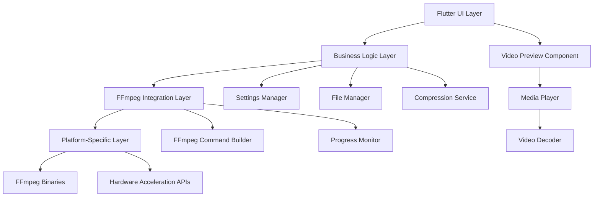

# Super Video Compressor - System Architecture

## High-Level Architecture

## Component Details

### Flutter UI Layer
- **File Picker**: Select input video files
- **Parameter Panel**: Configure format, codec, resolution
- **Preview Widget**: Display thumbnails and playback
- **Progress Indicator**: Show compression progress
- **Output Panel**: Display results and errors

### Business Logic Layer
- **Compression Service**: Orchestrates the compression process
- **Settings Manager**: Handles user preferences and configurations
- **File Manager**: Manages input/output file operations
- **Validation Service**: Validates input parameters and files

### FFmpeg Integration Layer
- **FFmpeg Wrapper**: Dart interface to FFmpeg commands
- **Command Builder**: Constructs FFmpeg command strings
- **Hardware Detector**: Identifies available hardware acceleration
- **Progress Parser**: Monitors FFmpeg output for progress updates

### Platform-Specific Layer
- **Binary Manager**: Handles FFmpeg binary loading per platform
- **Hardware API Bridge**: Interfaces with platform-specific acceleration APIs
- **Native Plugins**: Platform-specific code for advanced features

## Data Flow

1. User selects input video via File Picker
2. UI collects compression parameters
3. Business Logic validates parameters
4. FFmpeg Integration builds command with hardware acceleration
5. Platform Layer executes FFmpeg with appropriate binaries
6. Progress updates flow back through layers to UI
7. Output file is generated and preview updated

## Technology Stack
- **Frontend**: Flutter (Dart)
- **Backend**: Dart Isolates for background processing
- **Media Processing**: FFmpeg
- **Hardware Acceleration**: Platform-specific APIs
- **State Management**: Provider/Bloc pattern
- **Dependency Injection**: GetIt or similar

## Cross-Platform Considerations
- FFmpeg binaries bundled for each platform
- Hardware acceleration detection at runtime
- Platform-specific UI adaptations
- Native file system access via Flutter plugins