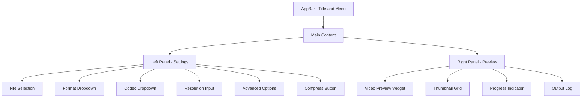

# Super Video Compressor - UI Components and Layout

## Main Screen Layout

## Key UI Components

### AppBar
- Application title: "Super Video Compressor"
- Menu button for settings/preferences
- Minimize/maximize/close buttons

### Left Panel (Settings)
- **File Selection Section**
  - Drag & drop area or file picker button
  - Selected file display with metadata (duration, size, resolution)
  - Multiple file selection for batch processing

- **Compression Parameters**
  - Output Format: Dropdown with common formats (MP4, AVI, MOV, WebM, etc.)
  - Video Codec: Dropdown with available codecs (H.264, H.265, VP9, AV1, etc.)
  - Audio Codec: Dropdown (AAC, MP3, Opus, etc.)
  - Resolution: Custom input fields (Width x Height) with aspect ratio lock
  - Quality/Bitrate: Slider or input field
  - Frame Rate: Dropdown or input

- **Advanced Options** (Collapsible)
  - Hardware acceleration toggle
  - Two-pass encoding option
  - Audio settings (channels, sample rate)
  - Subtitle handling
  - Metadata preservation

- **Action Buttons**
  - Compress: Primary action button
  - Cancel: Secondary button (during compression)
  - Reset: Clear all settings

### Right Panel (Preview)
- **Video Preview Widget**
  - Video player with play/pause/seek controls
  - Fullscreen toggle
  - Volume control
  - Time display

- **Thumbnail Preview**
  - Grid of video thumbnails (input and output)
  - Click to switch between input/output preview

- **Progress Section**
  - Linear progress bar
  - Percentage and ETA display
  - Current operation status

- **Output Log**
  - Scrollable text area for FFmpeg output
  - Error highlighting
  - Copy to clipboard option

## Responsive Design
- Desktop: Side-by-side panels
- Tablet: Stacked layout with collapsible panels
- Mobile: Single panel with bottom sheet for settings

## Theme and Styling
- Material Design 3
- Dark/Light mode support
- Custom color scheme (blue primary)
- Consistent spacing and typography

## State Management
- Provider pattern for global state
- Separate providers for:
  - File selection state
  - Compression parameters
  - Preview state
  - Progress state

## Navigation
- Single main screen (initial version)
- Future: Settings screen, Batch processing screen

## Accessibility
- Keyboard navigation support
- Screen reader labels
- High contrast mode
- Scalable UI elements